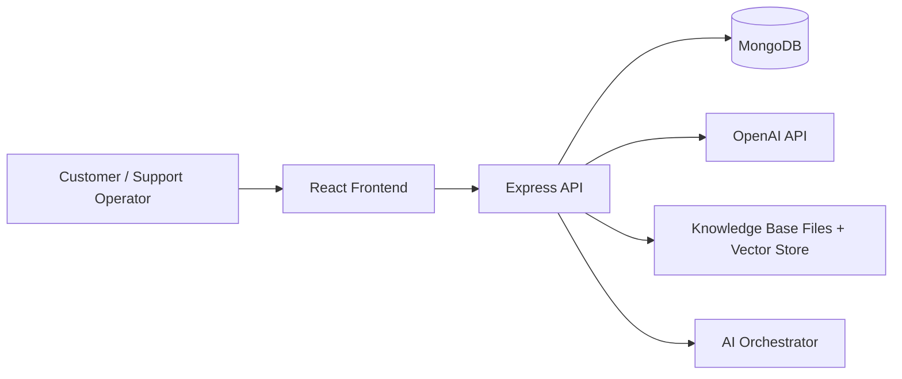
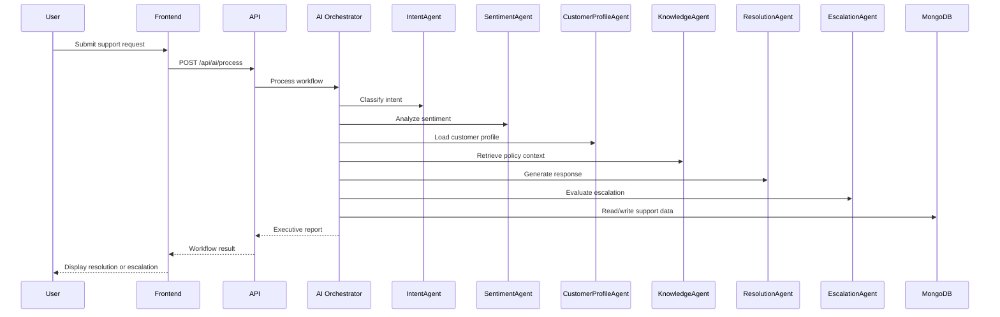

# Architecture

## 30-Second Summary

ResolveAI is a React + Express + MongoDB customer support platform powered by an AI orchestrator. A customer message enters the frontend, the backend runs a sequence of specialized agents, and the system returns a resolution, escalation decision, and executive report.

## High-Level Architecture

## Core Components

### Frontend

The frontend is a Vite-powered React application located in `src/`. It provides:

- Landing page and product overview
- Authentication screens
- Dashboard, customers, tickets, workspace, and analytics views
- API integration through `src/services/api.js`

### Backend

The backend is an Express application located in `backend/`. It exposes REST endpoints for authentication, customers, tickets, conversations, AI processing, analytics, and knowledge management.

Key backend responsibilities:

- Authentication and JWT protection
- Database access through Mongoose models
- Knowledge upload and retrieval
- AI workflow execution
- Logging, metrics, and analytics aggregation

### MongoDB

MongoDB stores the structured application data:

- Users
- Customers
- Tickets
- Conversations

The backend also seeds initial support data and policy documents for the knowledge layer when a database connection is available.

### OpenAI

The `ResolutionAgent` attempts to use the OpenAI Chat Completions API when `OPENAI_API_KEY` is present. If the OpenAI request is unavailable, the code falls back to the local helper path so the workflow remains functional during demos.

### AI Orchestrator

`backend/services/AIOrchestrator.js` coordinates all agent execution. It:

- Starts and tracks workflow state
- Runs each agent in sequence
- Retries transient failures
- Aggregates confidence and recommendations
- Builds the executive report
- Emits workflow logs and metrics

## Agent Map

### IntentAgent

`backend/services/agents/IntentAgent.js` classifies the issue category using message patterns and fallback AI guidance.

### SentimentAgent

`backend/services/agents/SentimentAgent.js` estimates sentiment and emotional tone.

### CustomerProfileAgent

`backend/services/agents/CustomerProfileAgent.js` loads customer records and historical tickets from MongoDB.

### KnowledgeAgent

`backend/services/agents/KnowledgeAgent.js` retrieves relevant policy passages from the knowledge base.

### ResolutionAgent

`backend/services/agents/ResolutionAgent.js` composes the final customer response with OpenAI or fallback generation.

### EscalationAgent

`backend/services/agents/EscalationAgent.js` decides whether the issue should be escalated to a human agent.

## Ticket Generation

Ticket generation occurs when the workflow determines the issue should be escalated or when a case needs formal follow-up. Ticket endpoints are exposed through `backend/routes/ticketRoutes.js`.

## Executive Report

The orchestrator returns a structured report containing:

- Confidence score
- Final decision
- Escalation flag
- Customer satisfaction prediction
- Root cause summary
- Smart recommendations
- Human review indicator

This report powers the dashboard and executive summary views.

## Analytics

Analytics are derived from ticket, workflow, and AI processing data. The backend exposes aggregate metrics through `backend/routes/analyticsRoutes.js` and AI monitoring endpoints through `backend/routes/aiRoutes.js`.

## Judge-Friendly Workflow

## Diagram Export Recommendations

- Export Mermaid diagrams as SVG if you plan to embed them into slides or PDF submissions.
- Keep the README diagrams simple and linear so they render well on mobile and GitHub dark/light modes.
- If you use an image export, keep a PNG copy under `docs/diagrams/` and reference it from the README.
- Avoid overcrowding the diagram with implementation internals; judges should understand the flow in one glance.