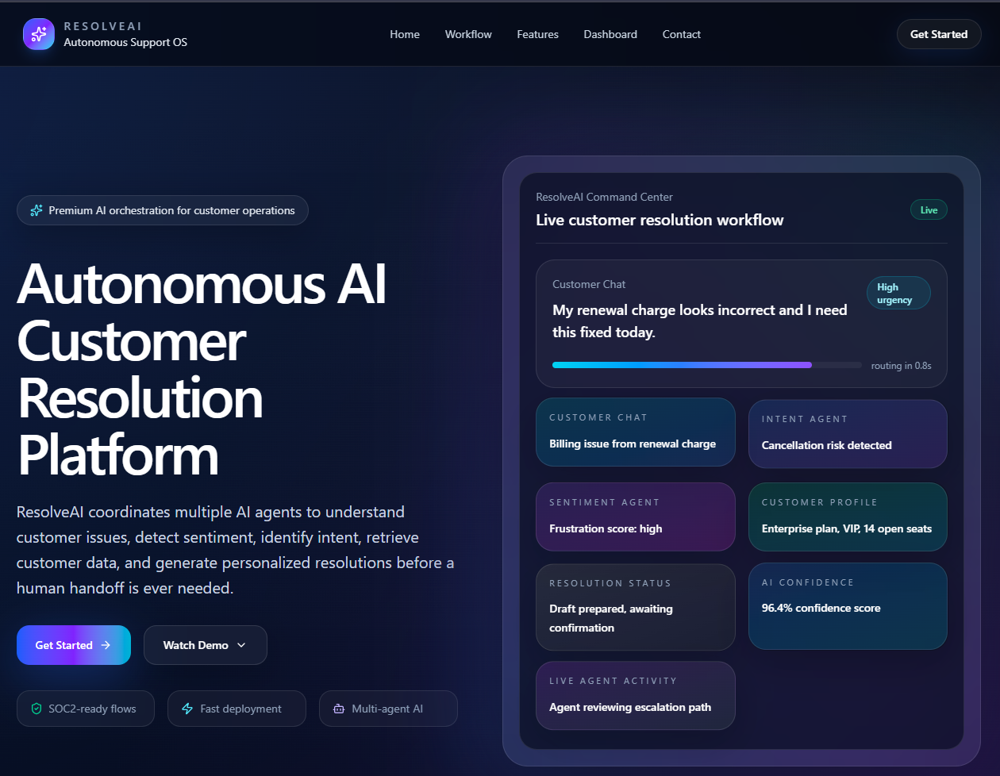
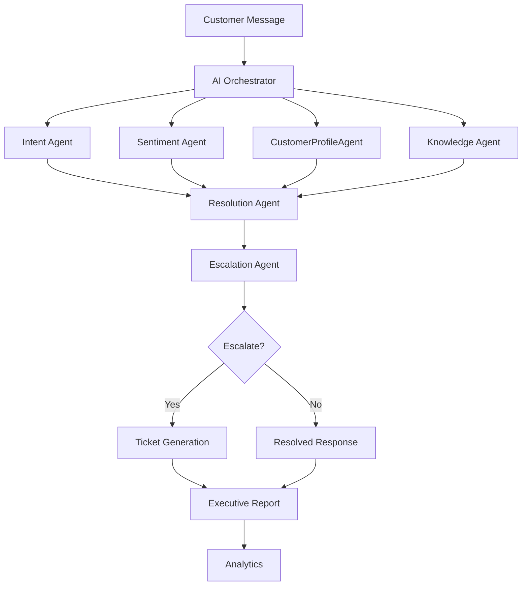
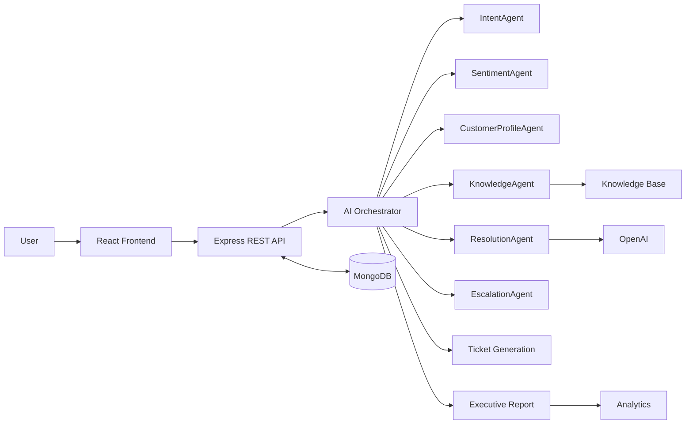

# ResolveAI

[](./package.json)
[](./package.json)
[](./backend/package.json)
[](./backend/package.json)
[](./LICENSE)

> Autonomous customer resolution for support teams that need speed, context, and consistency.



ResolveAI is a multi-agent customer support platform that classifies issues, analyzes sentiment, retrieves knowledge, drafts responses, decides escalation, and generates reporting for support leaders.

### Quick Links

- [Why ResolveAI?](#why-resolveai)
- [Project Overview](#project-overview)
- [Screenshots](#screenshots)
- [Architecture](#architecture-diagram)
- [Installation](#installation)
- [API Overview](#api-overview)
- [Deployment](#deployment)
- [Technical Report](./TECHNICAL_REPORT.md)
- [Architecture Doc](./Architecture.md)
- [Submission Checklist](./SUBMISSION_CHECKLIST.md)

## 🚀 Why ResolveAI?

- It turns customer support from a manual queue into an AI-assisted workflow.
- It gives judges a clear multi-agent story instead of a generic chatbot demo.
- It combines operational usefulness with measurable AI orchestration.
- It shows a complete product surface: landing page, dashboard, customers, tickets, workspace, analytics, and executive reporting.

## 📌 Project Overview

Modern support teams spend most of their time moving between customer context, policy documents, response drafting, and escalation decisions. ResolveAI consolidates that work into one AI-assisted platform with a structured agent orchestration layer and a support operations dashboard.

## 🧩 Problem Statement

Customer support operations are usually fragmented across inboxes, knowledge bases, ticketing tools, and manual escalation workflows. This creates:

- Slow response times
- Inconsistent support quality
- Repetitive triage work
- Poor visibility into recurring issues
- Higher operational cost as support volume grows

## 💡 Solution

ResolveAI coordinates specialized AI agents around each support step. The platform can understand the customer request, evaluate tone and urgency, retrieve relevant policy information, draft a helpful response, and decide whether the case should be escalated or converted into a support ticket.

## ✨ Key Features

- Multi-agent AI orchestration for support resolution
- Intent and sentiment analysis
- Customer profile lookup and case history context
- Knowledge base retrieval with policy-backed answers
- AI-generated resolution responses
- Escalation detection and ticket creation
- Executive report generation and analytics dashboard
- Authentication, customer management, ticket management, and knowledge management
- Responsive interface for desktop and mobile workflows

## 🧠 AI Agent Architecture

ResolveAI uses a layered orchestrator that coordinates these agents:

- `IntentAgent` - classifies the support issue
- `SentimentAgent` - estimates tone, urgency, and emotional state
- `CustomerProfileAgent` - loads the customer profile and previous cases
- `KnowledgeAgent` - retrieves relevant policies and knowledge snippets
- `ResolutionAgent` - generates the final response using context and policy retrieval
- `EscalationAgent` - decides whether human intervention is required

## 🔄 System Workflow



## 🏗️ Technology Stack

### Frontend

- React 19
- Vite
- React Router
- Axios
- Framer Motion
- Chart.js
- Tailwind CSS v4

### Backend

- Node.js
- Express.js
- MongoDB + Mongoose
- JWT authentication
- Multer for uploads
- pdf-parse, mammoth, and jszip for document handling

### AI and Data

- OpenAI API for response generation
- Gemini fallback helper for resilience
- Knowledge retrieval pipeline with local knowledge store and vector matching
- MongoDB for users, customers, conversations, and tickets

## 🧭 Architecture Diagram



## 📷 Screenshots

1. 
- Landing / Hero: product promise, brand, and immediate context
2. 
 - Dashboard: operations overview and system health
3. 
 - Customers: support context and account history
4. 
- AI Workspace: orchestrator visibility and workflow execution
5. 
- Tickets: escalation and case handling
6. 
 - AI Resolution: generated reply and reasoning
7. 
- Analytics: impact, trends, and performance


## ⚙️ Installation

### Prerequisites

- Node.js 18+
- MongoDB Atlas or local MongoDB
- OpenAI API key

### Frontend

```bash
npm install
npm run dev
```

### Backend

```bash
cd backend
npm install
npm run dev
```

## 🔐 Environment Variables

### Frontend

Create a root `.env` file from `.env.example`:

```env
VITE_API_URL=http://localhost:5000
```

### Backend

Create `backend/.env` from `backend/.env.example`:

```env
PORT=5000
MONGODB_URI=mongodb+srv://<user>:<password>@<cluster>/<database>
JWT_SECRET=replace-with-a-strong-secret
OPENAI_API_KEY=sk-your-openai-key
OPENAI_MODEL=gpt-4o-mini
GEMINI_API_KEY=
NODE_ENV=development
```

## 🗂️ Project Structure

```text
resolveai/
├─ src/
│  ├─ components/
│  ├─ pages/
│  ├─ routes/
│  └─ services/
├─ backend/
│  ├─ config/
│  ├─ controllers/
│  ├─ data/
│  ├─ middleware/
│  ├─ models/
│  ├─ routes/
│  └─ services/
├─ Architecture.md
├─ README.md
└─ TECHNICAL_REPORT.md
```

## 🔌 API Overview

Base URL: `VITE_API_URL` on the frontend, defaulting to `http://localhost:5000`.

### Authentication

- `POST /api/auth/register`
- `POST /api/auth/login`
- `GET /api/auth/me`

### Customers

- `GET /api/customers`
- `POST /api/customers`
- `GET /api/customers/:id`
- `PUT /api/customers/:id`
- `DELETE /api/customers/:id`

### Tickets

- `GET /api/tickets`
- `POST /api/tickets`
- `GET /api/tickets/:id`
- `PUT /api/tickets/:id`
- `DELETE /api/tickets/:id`
- `GET /api/tickets/analytics`

### Conversations

- `GET /api/conversations`
- `POST /api/conversations`

### AI Orchestration

- `POST /api/ai/process`
- `GET /api/ai/health`
- `GET /api/ai/metrics`
- `GET /api/ai/logs`
- `GET /api/ai/state`
- `GET /api/ai/state/:workflowId`
- `GET /api/ai/monitor`

### Knowledge

- `GET /api/knowledge`
- `POST /api/knowledge/upload`
- `POST /api/knowledge/retrieve`
- `GET /api/knowledge/monitor`
- `DELETE /api/knowledge/:id`

### Analytics

- `GET /api/analytics`

## 🚢 Deployment

### Frontend

Deploy the Vite app to Vercel or any static hosting platform.

### Backend

Deploy the Express API to Render, Railway, or another Node.js host.

### Database

Use MongoDB Atlas for production deployments.

## 🌐 Live Demo

> Add the live demo URL here before submission.

## 🎥 Demo Video

> Add the demo video URL here before submission.

## 🔮 Future Enhancements

- Real-time chat and agent handoff
- Email and notification automation
- Multi-language support
- Advanced SLA tracking
- Role-based admin controls
- CRM integrations
- Voice support and call transcript processing
- Feedback-driven model tuning

## 👥 Team

- Team Name: ResolveAI
- Project Type: Hackathon submission
- Contributors: Add teammate names and roles here

## 📄 License

Released under the MIT License. Update the repository license file if needed before public release.
